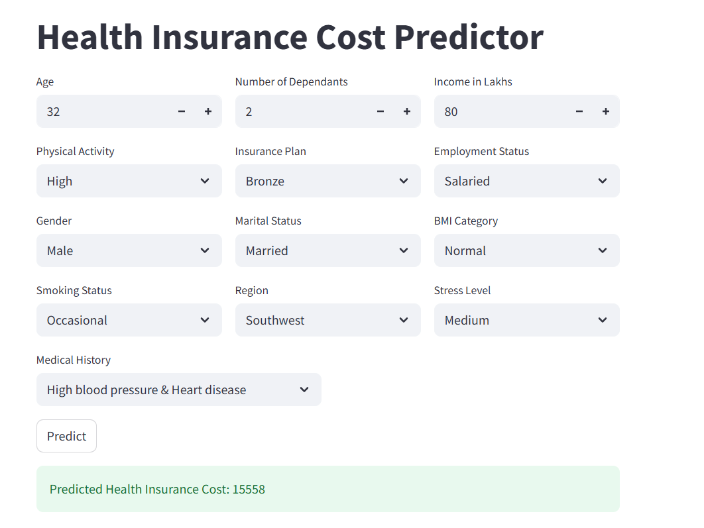

# 🏥 Health Insurance Cost Predictor 💰

This is an interactive Streamlit app that predicts the health insurance cost for individuals based on their personal and lifestyle information. It combines machine learning with a clean and intuitive UI to help users understand potential costs and risk factors. 🔍📊

## 🔗 Link to the Streamlit App
[Health Insurance Cost Predictor](https://ml-project-preium-prediction.streamlit.app/)

## 🚀 Features
✅ Predicts insurance cost based on:

Age, income, dependents

Physical activity & stress level

Smoking status & BMI category

Medical history & region

Type of insurance plan

✅ Uses a trained ML model built with scikit-learn and preprocessed using pandas.

✅ Built as an end-to-end solution:

🧠 Model Training in Jupyter Notebook

📦 Prediction logic in prediction_helper.py

🎨 User Interface with Streamlit in main.py

## 📂 Project Structure
```bash
├── main.py                       # Streamlit frontend
├── prediction_helper.py          # Data preprocessing and prediction logic
├── artifacts/
│   ├── model.joblib              # Trained ML model
│   └── scaler.joblib             # Scaler for numerical features
```

## 🤖 Model Behind the Scenes

At the core of this app is a high-performance **XGBoost** model trained to predict health insurance costs with excellent accuracy and precision.

✅ **Model**: [XGBoost (Extreme Gradient Boosting)](https://xgboost.readthedocs.io/en/stable/)

🎯 **Performance**:  
This model was built to meet specific project requirements — and it delivers:

- 📈 Achieved **99% accuracy**, surpassing the target of **97%**
- 🧮 On **at least 95% of predictions**, the **percentage difference** between the **predicted** and **actual** cost was **less than 10%**

📊 The model was trained on structured data including:
- Demographics: Age, Income, Dependents, Gender, Region
- Lifestyle: Physical Activity, Stress Level, Smoking Status
- Health: BMI Category, Medical History
- Plan details: Insurance Tier, Employment Status

The model was saved using `joblib` and integrated into the app via `prediction_helper.py` for fast and seamless prediction in real time.

## 🧠 How It Works
User fills in their details via the Streamlit interface.

Input is normalized and preprocessed using custom logic (e.g., risk scoring for medical history).

Features are scaled and passed to the ML model.

The model returns a predicted cost, shown instantly on screen.

## 🛠️ Tech Stack
Python 🐍

Streamlit 🌐

Scikit-learn 🤖

Pandas & Joblib 📦

🧪 Try it out locally
```bash
# Create virtual environment (optional but recommended)
python -m venv .venv
source .venv/bin/activate   # or .venv\Scripts\activate on Windows

# Install dependencies
pip install -r requirements.txt

# Run the app
streamlit run main.py
```

## 📸 Preview


## 🎯 Goal
This project was built as part of a data science bootcamp to practice:

Model building 🧮

Data preprocessing 🧼

Streamlit UI development 🎛️

End-to-end machine learning deployment 🧩

## 🙌 Acknowledgements
Thanks to Codebasics and the learning community that inspired this hands-on application of ML! 💪📘 
